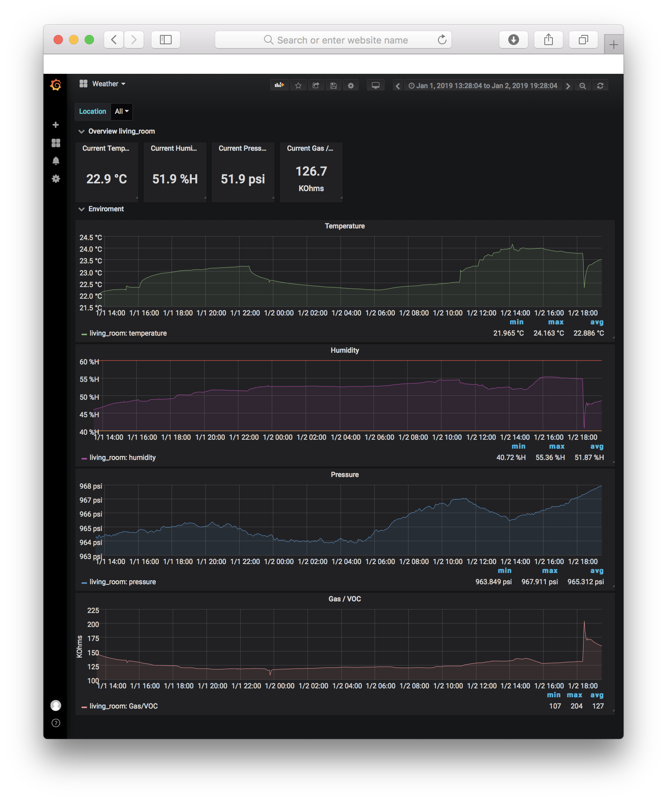

# Indoor Climate Sensor

Indoor climate sensor based on Wemos d1 mini pro microcontroller and Bosch BME680 sensor.

The collected data are sent over Wifi with MQTT to an MQTT Broker, where they can be read out with Telegraf and stored in an InfluxDB time series database.


## Requirement

- [WEMOS D1 Mini Pro](https://wiki.wemos.cc/products:d1:d1_mini_pro)
- [Bosch BME680](https://www.dfrobot.com/product-1697.html)
- Micro USB cabel
- [Arduino IDE](https://www.arduino.cc/en/Main/Software)
- soldering iron
- [InfluxDB](https://portal.influxdata.com/downloads/)
- [Telegraf Agent](https://portal.influxdata.com/downloads/)
- [MQTT Broker like Mosquitto](https://mosquitto.org)
- [Grafana](https://grafana.com)

## Measurement

- Temperature
- Humidity
- Pressure
- Gas resistance
- Altitude 

## Connecting the BME680 to a Wemos Mini D1

| Wemos      | BME680  |
|------------|---------|
| GND        | GND (-) |
| 3.3V       | VCC (+) |
| D2 (gpio4) | SDA (D) |
| D1 (gpio5) | SCL (C) |

## Set setting in the code

You need to set at least the following setting in indoor_climate_sensore.ino file, before you compile the Arduino code and flash it to the WEMOS microcontroller.

```c
#define WIFI_SSID "<your_wifi_ssid>"
#define WIFI_PASSWORD "<your_wifi_password>"
#define MQTT_USER "<your_mqtt_user>"
#define MQTT_PASSWORD "<your_mqtt_password>"
#define MQTT_HOST "<your_mqtt_host>"
```

## MQTT Broker

You need to set up your MQTT Broker like Eclipse Mosquitto.
More detail about Mosquitto can be found [here](https://mosquitto.org)

The indoor climate sensor, will send the following MQTT topics:

- weather/living_room/temperature
- weather/living_room/humidity
- weather/living_room/pressure
- weather/living_room/gas_resistance
- weather/living_room/altitude
- weather/living_room/voltage
- weather/living_room/telegraf

## Telegraf config

In the telegraf.conf file, it is required to activate the mytt_consumer input plugin. Subscribe to the topic **weather/living_room/telegraf** and set data_format to influx (line protocol)

```toml
[[inputs.mqtt_consumer]]
#   ## MQTT broker URLs to be used. The format should be scheme://host:port,
#   ## schema can be tcp, ssl, or ws.
  servers = ["tcp://localhost:1883"]
#
#   ## MQTT QoS, must be 0, 1, or 2
  qos = 0
#   ## Connection timeout for initial connection in seconds
#   connection_timeout = "30s"
#
#   ## Topics to subscribe to
  topics = [
    "weather/living_room/telegraf"
  ]
#
#   # if true, messages that can't be delivered while the subscriber is offline
#   # will be delivered when it comes back (such as on service restart).
#   # NOTE: if true, client_id MUST be set
#   persistent_session = false
#   # If empty, a random client ID will be generated.
#   client_id = ""
#
#   ## username and password to connect MQTT server.
  username = "<your_mqtt_user_name>"
  password = "<your_mqtt_user_password>"
#
#   ## Optional TLS Config
#   # tls_ca = "/etc/telegraf/ca.pem"
#   # tls_cert = "/etc/telegraf/cert.pem"
#   # tls_key = "/etc/telegraf/key.pem"
#   ## Use TLS but skip chain & host verification
#   # insecure_skip_verify = false
#
#   ## Data format to consume.
#   ## Each data format has its own unique set of configuration options, read
#   ## more about them here:
#   ## https://github.com/influxdata/telegraf/blob/master/docs/DATA_FORMATS_INPUT.md
  data_format = "influx"
```

## Grafana

Import the indoor_climate_sensore_dashboard.json file in Grafana.

